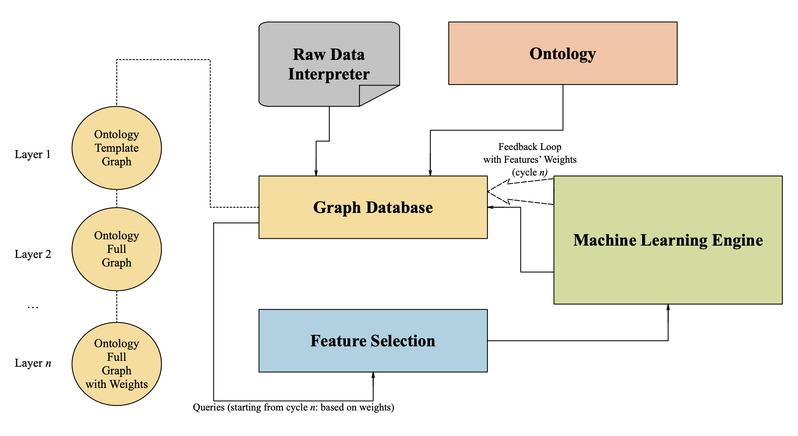

# Predictive Computational Model (PCM)
The aim of the research to create Generis Architecture for a Predictive Computational Model (PCM) capable of automating analytical conclusions regarding the particular type of data, where information is presented reliably and objectively. This model significantly helps to advance data analysis strategy by increasing the level of its consistency, reliability, and efficiency. A holistic approach is applied, intended at achieving systematic, functional, technical, methodological and informational compatibility of the components of the analysis into a single whole.

The proposed model’s main feature is the consolidation of information management with the decision-making process to serve the prediction purpose. This involves the management of a vast amount of heterogeneous data based on semantic methods and graph-based methods (ontology, knowledge graphs, graph database) as well as advanced machine learning methods.

The main focus of our research is advanced data pre-processing aimed at the more efficient feature selection.

The reaserch presents two use cases: the UK companies’ bankruptcy level detection (1) and FTSE100 index prediction (2).

__The pipeline:__ Raw Financial Data is fed to the Graph Database which is additionally structured by the Financial Ontology and updated by the feedback loop from the Machine Learning Engine. The latter is used to update the weights of the nodes/relationships in the Graph DB. The Graph DB queries output Features that serve the basis for the machine learning-based prediction. The output of the latter is fed back to the Graph DB to update the weights.

## Files List – Use Case 1 – Companys' Bunkruptcy Prediction (BPCM model)

- `weights_importance_uc1.csv` -- CSV file containing Random Forest Feature Importance Prediction Results.
- `BPCM_NN_v.2.0.py` -- Python Code of BPCM Neural Network.
- `BPCM_NN_testing.py` -- The Python Code for Neural Network evaluation purposes. 
- `Company_A_Fin_Indicators.csv` -- CSV file containing Company A data (collected from the FAME database).
- `Company_A_Fin_Ratios.csv` -- CSV file containing Company A data (collected from the FAME database).
- `cypher_queries_uc1.py` -- Python Code of Feature Selection in Neo4j.
- `feature_importance_uc1.py` -- Python Code of Random Forest Feature Importance Prediction.
- `import_to_neo4j_uc1.py` -- Python Code: Importing the OBP Ontology to Neo4j and Filling the Graph Database with data.
- `Input_Data_with_Neo4j_Feature_Selection.csv` -- CSV File with Selected Data imported from Neo4j.
- `NN_with_neo4j_feature_selection.py` -- Python Code of BPCM Neural Network with Feature Selection.
- `OBP_Ontology_v.2.1.owl` -- OBP Ontology OWL file.
- `Ratios_Export.csv` -- CSV File containing Input Data imported from Neo4j.
- `Training_Data_2017_71.csv` -- CSV File containing Complete Dataset for BPCM Neural Network for 2017.
- `Training_Data_2018_86.csv` -- CSV File containing Complete Dataset for BPCM Neural Network for 2018.
- `Training_Data_2019_87.csv` -- CSV File containing Complete Dataset for BPCM Neural Network for 2019.
- `Training_Data_2020_94.csv` -- CSV File containing Complete Dataset for BPCM Neural Network for 2020.
- `Training_Data_2021_113.csv` -- CSV File containing Complete Dataset for BPCM Neural Network for 2021.
- `training_data_file_after_neo4j_fs.py` -- Python Code: Data file after Feature Selection generation.
- `Training_Data_with_Neo4j_Feature_Selection.csv` -- CSV File containing Data after Feature Selection for BPCM Neural Network.

## Files List – Use Case 2 - Market Index Prediction (MIPCM model)

- `weights_importance_uc2.csv` -- CSV file containing Random Forest Feature Importance Prediction Results.
- `combined_output.csv` -- CSV file containing combined output of LSTMs generated in `main_lstms_concatenation_unit.py`.
- `cypher_queries_uc2.py` -- Python Code containing Feature Selection in Neo4j.
- `feature_importance_uc2.py` -- Python Code of Random Forest Feature Importance Prediction.
- `feature_selection_from_neo4j.csv` -- CSV File containing Input Data after Feature Selection imported from Neo4j.
- `fill_ontology_in_neo4j_uc2.py` -- Python Code: Filling the Neo4j database with Data.
- `final_results_feature_selection_neo4j.csv` -- CSV file containing Linear Regression final results with Feature Selection.
- `final_results.csv` -- CSV file containing Linear Regression final results (without Feature Selection).
- `import_to_neo4j_uc2.py` -- Python Code: Importing the OMIP Ontology to Neo4j.
- `Input_Data_from_Neo4j.csv` -- CSV File containing Data imported from Neo4j.
- `input_data_import_from_neo4j.py` -- Python Code: Importing Input Data from Neo4j.
- `linear_regression_feature_selection_neo4j.py` -- Python Code of PIPCM Linear Regression with Feature Selection.
- `linear_regression.py` -- Python Code of MIPCM Linear Regression (without Feature Selection).
- `main_lstms_concatenation_unit.py` -- Python Code: Concatenation Unit.
- `Price_Index_Prediction_v3.2.owl` -- OMIP Ontology RDF file (saved as OWL).
- `Processed_Input_Data_FTSE100_1985_21.csv` -- CSV file containing Input Data taken from external sources.
- `lstm_AWE.py, ..., lstm_UR.py` -- Python Code of single LSTMs for PIPCM.
- `ARIMAX_FTSE100.py` -- Python Code of ARIMAX model to predict FTSE100 close prices.
  
